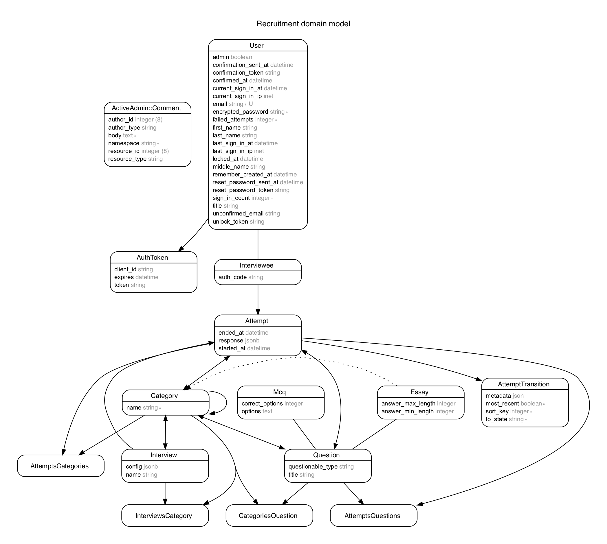

# README

## Features

 - Configure interviews for recruiting talent.
 - Supports Multiple Choice Questions (MCQs) and Essays.
 - Organize questions under categories and subcategories.
 - Track responses given by interviewees.
 
## To do

 - Make sure equal number of questions are sampled from each category
 - Add weights to questions, select questions based on how the interviewee is answering ( Eg:- Ask tougher questions if the interviewee is performing well) 
 - Add `mandatory_categories` for interviews
 - `scheduled_start` and `end` time for attempts
 - Time based interviews
 
## Prerequisites

 - Ruby version: **2.5.1**

 - Database: **PostgreSQL**
 
 - Node: **v9+**
 
 - NPM: **v5+**

### Database Setup

- Install PostgreSQL (you might also want to install pgAdmin3)
- Make sure your default user has the privilege to create databases.
- Setup DB credentials as per `config/database.yml`

Give super user privileges to recruitment user for postgres as given below.

```
sudo -u postgres bash -c "psql -c\"ALTER ROLE recruitment SUPERUSER CREATEDB;\""
```

### Install bundler

```ruby
gem install bundler
```
to install bundler gem. This sets up the bundle command on your machine, used below.

### Bundle install

Run **bundle** to install all the gems specified by `Gemfile`.
```ruby
bundle install
```

### Setup database

Run rails db setup task to setup database specified by `database.yml` file.
```ruby
bundle exec rails db:setup
```

### npm dependencies

Be sure that you have run the following command before you start the server:
```bash
npm install -g yarn
yarn install --check-files
```

### Running the server


The following command should be used to start the server in development mode.

```bash
foreman start -f Procfile.dev
```

This starts a webpack server in addition to the rails server (puma) so you can transpile your jsx files as soon as they are saved.

## Recruitment Setup

- `cp .env.example .env` and edit the ORG_NAME
- Copy Organization logo to `app/webpack/packs/images/logo.png`

## Interview setup.

### High level entities

- Interview setup can be done by logging in as a admin user @ `/admin`.
- Upon logging in you will be Rails Active admin dashboard.
- Setup `categories` of questions. `Category` can have subcategories.
- a `Question` can be either a `Mcq` or `Essay` (questionable polymorphic association)
- `Mcq` questions can take options. Each of the options support Markdown entry.
- `Mcq` questions also have `correct_options` - array indexes of the `options` that are correct.
- a `Question` can belong to multiple categories.
- an `Interview` is the question paper. You can configure the `categories` from which questions must be picked. 
- `Interview` can take additional `config` a JSON. 
- `config` currently supports
    * `maximum_questions` - Maximum questions in an interview
- Setup a `User`
- Associate a `Interviewee` to `User`. Upon saving a `Interviewee` a `auth_code` is generated. This is used for logging in the interviewee.
- An `Attempt` is the actual attempt of the `Interview`. An attempt can be created for an `Interviewee` for an `Interview`
- Note that both `Attempt` and `Interview` have associated `questions` and `categories`. 
`AttemptCategories` is the subset of `InterviewCategories` that the `Interviewee` chose to answer.


### ERD


